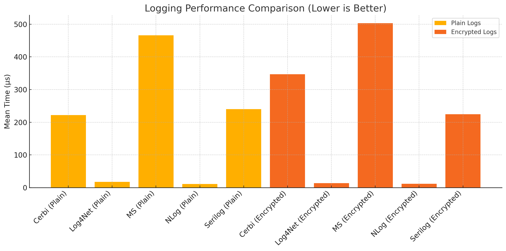
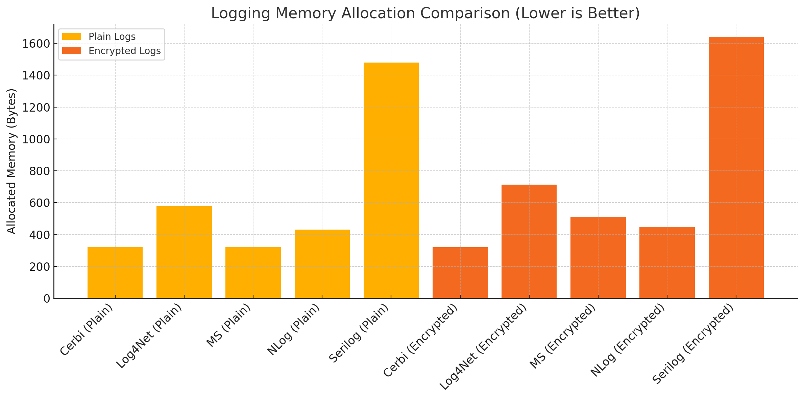

# 🚀 Cerbi Benchmark Suite

Welcome to the **Cerbi Benchmark Suite**, a comprehensive and transparent comparison of popular .NET logging libraries. This repo leverages [BenchmarkDotNet](https://benchmarkdotnet.org/) to evaluate performance, memory footprint, and encryption overhead in structured logging scenarios.

> 🧪 Public and reproducible — clone this repo, run it locally, and validate results yourself.

---

## 📦 Tested Loggers

- **[CerbiStream](https://www.nuget.org/packages/CerbiStream)** (v1.1.1)
- **Serilog** (v2.12.0-preview)
- **Microsoft.Extensions.Logging**
- **NLog** (v5.4.0)
- **Log4Net** (v3.0.5-preview)

All tests were executed with both plain and encrypted logging configurations.

---

## 📊 Benchmark Results

### ⏱️ Logging Performance (μs)



- CerbiStream performs comparably to Serilog and significantly faster than Microsoft Logging.
- NLog and Log4Net are fastest in raw log scenarios but lack encryption/governance features.

---

### 💾 Memory Allocation (bytes)



- CerbiStream maintains a **minimal memory footprint** even with encryption enabled.
- Serilog's rich pipeline comes at the cost of **4–5x more memory allocation**.

---

## 📖 Methodology

- **Tooling**: [BenchmarkDotNet v0.14.0](https://benchmarkdotnet.org/)
- **System**: Intel i9-9900K / .NET 8.0.13 / AVX2
- **Run Mode**: 10 iterations, 3 warmups per method
- **Destination**: In-memory/null sink to exclude I/O bottlenecks
- **Encryption**: Lightweight AES-style logic applied consistently across libraries

---

## 🔬 Key Insights

- ✅ CerbiStream balances **encryption, governance, and low allocations** with strong mid-tier performance.
- 🧠 Microsoft.Extensions.Logging is noticeably slower when encryption is added.
- 📉 NLog/Log4Net offer ultra-low latency but lack modern enterprise features like compliance validation.

---

## 📂 Files Overview

- `/results/`: Raw benchmark reports (HTML, CSV, Markdown)
- `/Charts/`: Visual comparison assets (ready for README or blog posts)
- `PopularLoggerBenchmarks.cs`: Test definitions using BenchmarkDotNet

---

## 🔍 Reproduce It

```bash
git clone https://github.com/your-org/Cerbi-Benchmark-Tests.git
cd Cerbi-Benchmark-Tests
dotnet run -c Release
